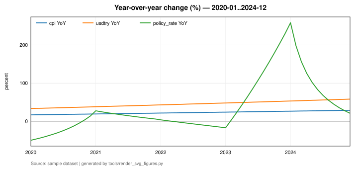
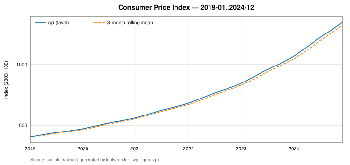
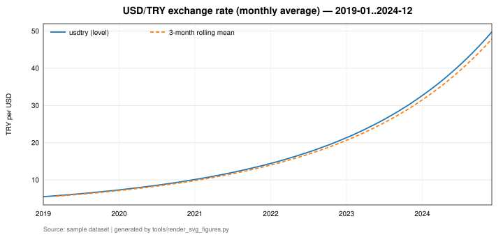
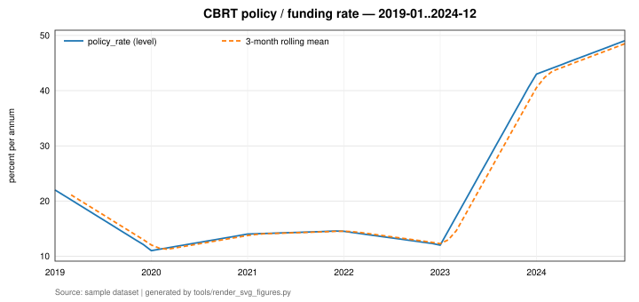

<h1 align="center">data-economic-lab</h1>

<p align="center">
  A macroeconomic pipeline that runs end to end with <b>no network and no API key</b> —<br>
  ingest → validate → store → analyze → report, with every claim in this file<br>
  labelled either <code>verified end-to-end</code> or <code>unverified</code>.
</p>

<p align="center">
  <a href="https://github.com/umutseve4/data-economic-lab/actions/workflows/ci.yml"></a>
  
  
  
</p>

<p align="center">
  
</p>

---

## Four commands, offline

```bash
python3.12 -m venv .venv && source .venv/bin/activate
pip install -e ".[dev]"

python -m ecolab validate     # structural checks only, no writes
python -m ecolab ingest       # fetch/load -> validate -> SQLite (idempotent)
python -m ecolab analyze      # YoY, rolling 3-month mean, correlation
python -m ecolab report       # reports/report.md + reports/figures/*.png
```

All four are `verified end-to-end`: executed by the `end-to-end` gate of CI run
**#18** (commit `ee05414`, exit code 0), offline, with `ECOLAB_SOURCE=sample` and
no API key present.

Exit codes: `0` success, `1` generic error, `2` configuration error,
`3` validation failure, `4` ingestion failure.

## What it computes

Three Turkish monthly macroeconomic series are ingested, validated against explicit
structural rules, stored in SQLite with a stable schema, and reduced to
year-over-year change, a rolling three-month mean, and a correlation table computed
on the **overlapping period only**. It is a data-engineering exercise, not a
forecasting or causal-inference exercise.

```
  ingest.py    ->   validate.py   ->    store.py    ->   analyze.py   ->   report.py
  EVDS API          schema check        SQLite            YoY %             report.md
  or sample CSV     duplicate dates     upsert on         rolling 3m        PNG figures
  retry+backoff     monotonic index     (series_code,     correlation       titles, units,
  cache to          gap > 1 period       period)          on overlap        source line
  data/raw/         parse errors        idempotent        n_obs reported

                        all orchestrated by cli.py  (the only module allowed to print)
```

| name | series code | unit | aggregation |
|---|---|---|---|
| `cpi` | `TP.FG.J0` | index (2003=100) | last |
| `usdtry` | `TP.DK.USD.A.YTL` | TRY per USD | avg |
| `policy_rate` | `TP.APIFON4` | percent per annum | avg |

Default date range: `2019-01-01` .. `2024-12-01` (72 monthly observations per
series). Primary source: TCMB EVDS API (`https://evds2.tcmb.gov.tr/service/evds`).
The API key is read from the `EVDS_API_KEY` environment variable and appears
nowhere in the source, tests, logs or this README.

```sql
CREATE TABLE observations (
    series_code TEXT NOT NULL,
    period      DATE NOT NULL,
    value       REAL,
    unit        TEXT NOT NULL,
    source      TEXT NOT NULL,
    ingested_at TIMESTAMP NOT NULL,
    PRIMARY KEY (series_code, period)
);
```

Running `ingest` a second time prints the same `Total rows in database: 216`.
Idempotency is enforced by the primary key `(series_code, period)` and an upsert.
It is covered by a dedicated unit test *and* asserted independently in CI:
`ci/e2e.sh` runs `ingest` twice and fails the build if the two totals differ.

## Results on the sample period

<p align="center">
  
  
</p>

<p align="center">
  
</p>

Regenerate them with one command (`verified end-to-end` in the offline environment):

```bash
PYTHONPATH=src ECOLAB_SOURCE=sample python tools/render_svg_figures.py
```

On the sample period 2019-01..2024-12 (n = 72) the level correlations are
cpi–usdtry **0.9926**, cpi–policy_rate **0.8541**, usdtry–policy_rate **0.8962**.
Correlations this high between levels are largely an artefact of three trending
series sharing a common time trend, so on their own they say very little. The
year-over-year panel is the more informative view: it shows the three series moving
in the same broad direction with a lag rather than in lockstep. Because
`data/sample/` is synthetic, none of these numbers carry economic meaning — they
demonstrate that the pipeline computes, aligns and reports correctly, and nothing
beyond that.

The same charts are also produced as PNG by `python -m ecolab report` under
`reports/figures/` (with title, axis units and a source line on every chart);
`reports/` stays uncommitted — download it as the `reports` artifact of any CI run.

## Limits — read before trusting a live run

- **The three EVDS series codes are `not implemented` (unverified).** They were written from documentation and were *not* confirmed against the live EVDS catalogue, because the build environment had no network access. Each can be overridden without touching the code: `ECOLAB_SERIES_CPI`, `ECOLAB_SERIES_USDTRY`, `ECOLAB_SERIES_POLICY_RATE`.
- **`python -m ecolab ingest` has never been executed against the real EVDS API with a real key.** The HTTP path, retry/backoff and auth-error handling are unit tested with a mocked transport only.
- **`data/sample/` is synthetic**, deterministic data produced by a closed-form formula (documented in `data/sample/README.md`). It exists only so tests and CI run with no network and no credentials. It is not real TCMB data and must not be presented as such.
- Correlation is not causation. No identification strategy is used anywhere.
- Revisions to official statistics are not handled; a later download silently overwrites an earlier value for the same `(series_code, period)`.
- The inflation series is not seasonally adjusted.
- The sample period (72 months) is short for any statistical inference.
- All results published here are computed on synthetic sample data.
- Year-over-year change is applied uniformly, including to `policy_rate`. For a rate series a percentage-point difference would be the more meaningful transform.
- Correlations are computed on levels, not on stationary transforms.
- Only complete cases enter the correlation. Missing values are reported explicitly and are never filled.
- Monthly aggregation (`last` vs `avg`) is declared per series but is applied to data that already arrives monthly; it is not exercised on higher-frequency input.
- Type checking covers `src/ecolab` only; `tests/` is not type checked.

**What this project does NOT do:** no dashboard, no web API, no machine-learning
model, no forecasting, no seasonal adjustment, no causal inference, no
multi-source reconciliation, no scheduler or orchestrator, no cloud deployment, no
alerting.

<details>
<summary><b>Configuration — every environment variable</b></summary>

```bash
cp .env.example .env      # then edit .env — never commit it
export EVDS_API_KEY=...   # only needed for --source evds
```

| variable | default | meaning |
|---|---|---|
| `ECOLAB_DATA_DIR` | `data` | root for `raw/`, `sample/`, the database |
| `ECOLAB_SOURCE` | `sample` | `sample` (offline CSV) or `evds` (live API) |
| `ECOLAB_DB_PATH` | `data/economic.db` | SQLite file |
| `ECOLAB_REPORT_DIR` | `reports` | report and figures output |
| `ECOLAB_START` | `2019-01-01` | first period (ISO date) |
| `ECOLAB_END` | `2024-12-01` | last period (ISO date) |
| `ECOLAB_LOG_LEVEL` | `INFO` | stdlib logging level |
| `ECOLAB_HTTP_TIMEOUT` | `30` | seconds |
| `ECOLAB_MAX_RETRIES` | `3` | retry attempts on transient failures |
| `ECOLAB_BACKOFF_BASE` | `1.0` | seconds; delay = base · 2^(attempt−1) |
| `ECOLAB_EVDS_BASE_URL` | `https://evds2.tcmb.gov.tr/service/evds` | API base |

</details>

<details>
<summary><b>Verbatim CLI output of each command</b></summary>

### `validate` — `verified end-to-end`

```
$ ECOLAB_SOURCE=sample python -m ecolab validate
OK cpi          code=TP.FG.J0             rows=  72 missing=0 range=2019-01..2024-12
OK usdtry       code=TP.DK.USD.A.YTL      rows=  72 missing=0 range=2019-01..2024-12
OK policy_rate  code=TP.APIFON4           rows=  72 missing=0 range=2019-01..2024-12
Validation passed for all series.
```

### `ingest` — `verified end-to-end` with `--source sample`; `implemented` (unverified) against the live EVDS API

```
$ ECOLAB_SOURCE=sample python -m ecolab ingest
cpi          code=TP.FG.J0             rows=  72 missing=0 range=2019-01..2024-12
usdtry       code=TP.DK.USD.A.YTL      rows=  72 missing=0 range=2019-01..2024-12
policy_rate  code=TP.APIFON4           rows=  72 missing=0 range=2019-01..2024-12
Database: data/economic.db
Rows written this run: 216
Total rows in database: 216
```

### `analyze` — `verified end-to-end`

```
$ ECOLAB_SOURCE=sample python -m ecolab analyze
== Coverage (levels) ==
cpi          range=2019-01..2024-12 n=72 missing=0
usdtry       range=2019-01..2024-12 n=72 missing=0
policy_rate  range=2019-01..2024-12 n=72 missing=0

== Year-over-year change (%), last 6 rows ==
               cpi  usdtry  policy_rate
period
2024-07-01  27.599  55.706       67.754
2024-08-01  27.812  56.155       55.132
2024-09-01  28.024  56.605       44.512
2024-10-01  28.236  57.057       35.452
2024-11-01  28.449  57.510       27.632
2024-12-01  28.662  57.964       20.813

== Rolling 3-month mean (levels), last 6 rows ==
                 cpi  usdtry  policy_rate
period
2024-07-01  1196.267  39.441        45.75
2024-08-01  1221.720  40.978        46.30
2024-09-01  1246.220  42.585        46.85
2024-10-01  1270.153  44.266        47.40
2024-11-01  1294.270  46.024        47.95
2024-12-01  1319.513  47.863        48.50

== Correlation (levels, overlapping period only) ==
overlap range = 2019-01..2024-12, n_obs = 72
                cpi  usdtry  policy_rate
cpi          1.0000  0.9926       0.8541
usdtry       0.9926  1.0000       0.8962
policy_rate  0.8541  0.8962       1.0000

Correlation is not causation.
```

### `report` — `verified end-to-end`

```
$ ECOLAB_SOURCE=sample python -m ecolab report
Wrote reports/report.md
Figures in reports/figures
```

</details>

<details>
<summary><b>Testing — measured coverage table, read honestly</b></summary>

```bash
pytest --cov=ecolab --cov-report=term-missing --cov-branch --cov-fail-under=90
```

**Measured coverage: 92 % — `verified end-to-end`.** Measured, not estimated. The
figure below is the verbatim output of the `pytest` gate in CI run **#18** (commit
`ee05414`), on Python 3.12.13 / pytest 8.4.2 / pytest-cov, with branch coverage
enabled:

```
Name                     Stmts   Miss Branch BrPart  Cover   Missing
--------------------------------------------------------------------
src/ecolab/__init__.py       3      0      0      0   100%
src/ecolab/__main__.py       4      4      2      0     0%   3-8
src/ecolab/analyze.py       50      0      6      0   100%
src/ecolab/cli.py          112      9     14      2    91%   82, 148, 184-185, 187-188, 192-194
src/ecolab/config.py        89      4     12      0    96%   89-90, 97-98
src/ecolab/errors.py        13      0      0      0   100%
src/ecolab/ingest.py       118     13     34      6    86%   75-76, 86, 93, 131->160, 172-174, 193-198, 223, 250
src/ecolab/report.py        88      3     18      4    93%   55, 58->65, 124, 155
src/ecolab/store.py         57      4      6      1    92%   65-67, 155
src/ecolab/validate.py      75      2     28      2    96%   69, 97
--------------------------------------------------------------------
TOTAL                      609     39    120     15    92%
62 passed in 5.92s
```

Reading of that table, stated plainly:

- Every module in `src/ecolab` has at least one test, as required.
- `__main__.py` shows 0 %. It is the four-line `python -m ecolab` entry point. The test suite calls `cli.main()` in-process, which does not execute it. It *is* executed by `ci/e2e.sh`, which runs `python -m ecolab ...` — but that is a separate process and `pytest-cov` does not measure it. Its 4 statements are the single largest reason the total is 92 % and not higher.
- `ingest.py` is the weakest measured module at 86 %. Its uncovered statements are concentrated in the live-HTTP error branches, which is consistent with the fact that the real EVDS API has never been called.

A floor of `--cov-fail-under=90` is enforced in CI, so a coverage regression fails
the build rather than passing quietly.

| test file | tests | covers |
|---|---|---|
| `test_ingest.py` | 15 | ingest.py |
| `test_config.py` | 13 | config.py, errors.py |
| `test_validate.py` | 10 | validate.py (each failure mode individually) |
| `test_analyze.py` | 7 | analyze.py (YoY on a hand-written fixture) |
| `test_cli.py` | 7 | cli.py (end-to-end via `cli.main()`, sample data only) |
| `test_store.py` | 6 | store.py (idempotency) |
| `test_report.py` | 4 | report.py |

**Sample data reproducibility: `verified end-to-end`.** `scripts/gen_sample.py`
regenerates `data/sample/*.csv` from closed-form functions with no randomness.
Running it leaves the checked-in files byte-identical, and
`python scripts/gen_sample.py --check` verifies this without writing. CI runs the
`--check` form as the `sample-drift` gate, so the sample data can never drift from
its generator. (`scripts/gen_sample.py` sits outside the pipeline chain; it only
regenerates the committed offline fixtures.)

</details>

<details>
<summary><b>CI status — six gates, run #18</b></summary>

CI run **#18** (commit `ee05414`) passed all six gates. Toolchain as reported by the
run: Python 3.12.13, ruff 0.16.2, mypy 1.20.2, pytest 8.4.2.

| gate | command | exit code | result |
|---|---|---|---|
| `ruff-check` | `ruff check .` | 0 | pass |
| `ruff-format` | `ruff format --check .` | 0 | pass |
| `mypy` | `mypy src/ecolab` | 0 | pass |
| `pytest` | `pytest --cov=ecolab --cov-report=term-missing --cov-branch` | 0 | pass |
| `sample-drift` | `python scripts/gen_sample.py --check` | 0 | pass |
| `end-to-end` | `bash ci/e2e.sh` | 0 | pass |

The `pytest` gate has since gained `--cov-fail-under=90`; that flag is
`implemented` and takes effect on the next run. Everything else in the table is
unchanged.

The whole run is offline: no network call, no `EVDS_API_KEY`. The workflow
additionally asserts that no secret is committed (a tracked `.env`, or an
`EVDS_API_KEY=` value that is not the placeholder) before running anything else.

`ci/gates.sh` runs every gate without stopping at the first failure and writes each
gate's full output into the run **Summary**, so a failure is diagnosable from the
browser without downloading logs. `reports/` is uploaded as a build artifact on
every run, including failed ones.

Note: `mypy` is invoked as `mypy src/ecolab`, which overrides the `files` setting in
`pyproject.toml`. Type checking therefore covers `src/ecolab` only, not `tests/`.

A push made by the `format` workflow uses `GITHUB_TOKEN` and therefore does **not**
re-trigger `ci`; start `ci` manually afterwards.

**Verifying without a local Python environment** — everything below runs on
GitHub's runners:

| goal | where | how |
|---|---|---|
| run ruff, mypy, pytest, and the CLI end-to-end | Actions → `ci` | Run workflow |
| read every gate's full output and the coverage table | Actions → `ci` → run → **Summary** | expand the gate you want |
| download `report.md` and the PNG charts | same run page | **Artifacts → reports** |
| fix a `ruff format --check` failure | Actions → `format` | Run workflow |

</details>

---

MIT — see [`LICENSE`](LICENSE).
